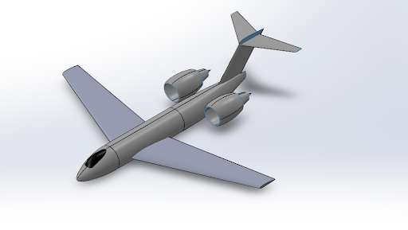
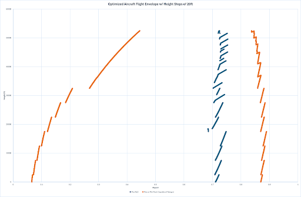
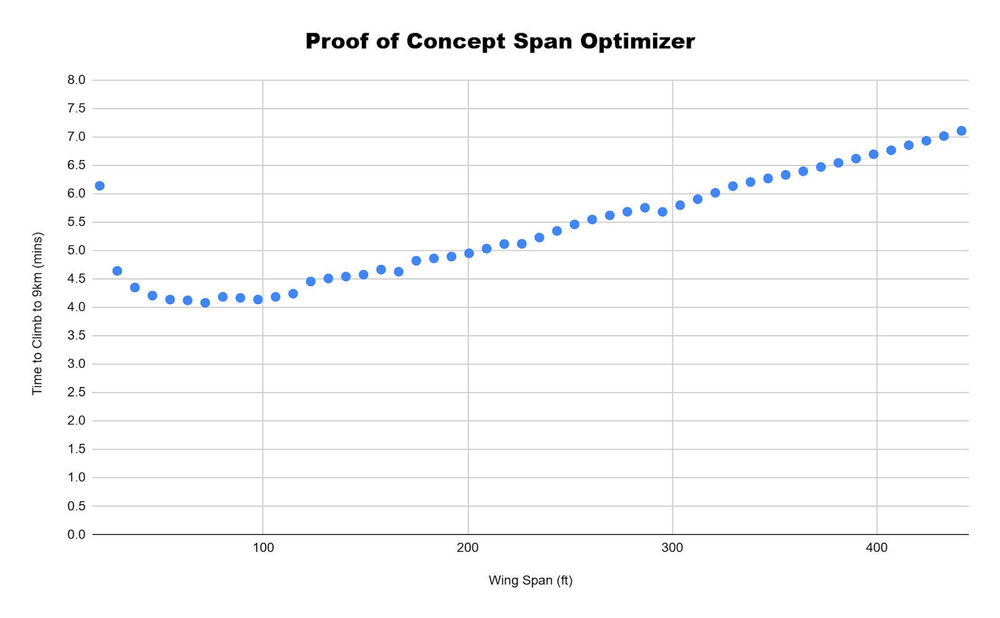

<div align="center">

# to-9km-and-beyond 

## Time to Climb Project (Wing Optimization Program for a Subsonic Aircraft)
## by Kaden Dadabhoy

</div>

<br>

## Overview and Coding Methodology

### Main Objective 
__The main objective of this program is to be used to optimize the main wing of an aircraft to beat the FAI record for C-1k planes climbing to 9,000m with a 1,000kg payload (https://fai.org/record/4918), currently held by Gary M. Freeman.__ In other words, the goal of this program is to be used to optimize a main wing around the airplane's climb time to 9,000m. 

For any aircraft configuration (set by the user), this program will also produce best wing* and its corresponding climb time to 9,000m. This climb time can then be prepared to Freeman's 5 min 54s record. Using this program, one can easily design (at least the wing) of an airplane, which can beat Freeman's record. which can then be compared to Freeman's 5 min 54s record, 

__Note: The program is currently set up to output the simulation data into the console, and produce two .csv files. One csv file is a bunch of wing spans simulated, and one csv file is a bunch of sweep angles simulated for the best span. Currently, the program is set up to only simulate 25 wing spans, and 25 sweep angles\*. In order for it to act as an optimizer, increase the number of simulations to 200+ for span and 100+ for sweep angle, or drastically reduce the range.__ 


\* The program is set up in the current manner, in order for a user to be able to easily see how it works, without needing to wait 10 mins for a bunch of simulations. A user should expect to only wait around 1-2mins for the program to run with its current set up. __Additionally, since this program does not account for structural feasibility (due to empirical equations not being reliable), it is my belief that it is more beneficial for the program to produce an easily plottable .csv file, for the user to interpret, rather than a traditional optimizer that just outputs one wing.__ 

\** __One simulation of an airplane object to 9km should take ~1.2 seconds__ (if not aborted because the airplane can't takeoff, can't reach 9km, etc). __CSV functions should be almost instatenous__

<br>
<br>


### Coding Methodology Overview
__A secondary goal of the project was to have the program be robust.__ Robust meaning that any component could be easily modified - in a safe manner - by any user familiar with C++. Classes (OOP) were used to accomplish this goal. 

__Every Airplane has (at least) a mainWing, a Horizontal Tail, a Vertical Tail, Engine(s), Nacelle(s), a Fuselage, a fuel weight, and a payload weight.__ 
So, each of the corresponding main components (everything that isn't a single float or integer variable) have their own classes. (Note: these classes are not derived from Airplane, because they have a "has-a," not an "is-a" relationship).

Note: It could be helpful to know, now, that in the current Airplane Class implementation every Airplane has two identical engines and two identical nacelles.


<br>
<br>


### How Object Oriented Programming (OOP) Enables Robustness w/ Examples 
#### (Feel Free to  Skip if Already Familiar with OOP)
__Object Oriented Programming (OOP) essentially allows a programmer to create a new "type".__ Common types are ints, doubles, char, etc. In order to create a new type, a programmer needs to create a class (header and implementation files). This class is the new type. __When a variable is assigned with the new type, it is known as an object. Objects have access to all the public member functions__ (and/or variables... although that is poor practice), that the class defines. Additionally objects have private member variables, which are initialized in the constructor. There is a LOT more detail behind OOP, like polymorphism, encapsulation, best practices, dynamic classes, constructors, destructors, operator overloading, etc; however, the main takeaways are:

        1. The programmer can create any new type
        2. The programmer can develop any functions for the type
        3. Each object has access to the public member functions
        4. Objects (typically are) very memory intensive, so avoid copying them as much as possible
            - ALWAYS pass them by reference
        5. In many ways classes are black boxes 
            - You don't need to know how the public member functions are implemented, just that they exist


This methodology, as those familiar with OOP already know, enables the Airplane class to treat each of these components (class objects) as a "black box." In other words, it does not matter, from the Airplane Class's point of view, how the Wing (for example) object is implemented, just that we have a type Wing, and we can call on its public member functions. Again, as those familiar with OOP already know, this is an incredibly robust approach, since we are now able to change the implementation of major components, without having to change anything in the Airplane class, as long as the same functions still exist. It is incredibly hard to underscore how useful this is.

For example, if we ever wanted to code an Airplane to go supersonically, we would just need to modify the classes whose implementation changes based on if an aircraft is subsonic or supersonic (namely the Drag Class).

Another example, is currently the Wing class operates under the assumption that every wing is trapezoidal . The airplane class doesn't care about these assumptions, just that it has a Wing object that can call on certain (necessary) public member functions that the Airplane Class's implementation may need. So, if we ever wanted to run this program with a non-trapezoidal wing, the only thing we would have to change is the implementation of Wing Class to be able to handle trapezoidal Wings. (Note: One approach (polymorphism) is making the Wing class a base class and deriving a trapezoidal wing class from the Wing Class, and then deriving the other type of wing from the Wing Class, which is a bit more advanced than just changing the member functions of the Wing Class, but is still in essence, just changing the implementation of the Wing Class). 

__The cost of the robustness gained from using this methodology, is the time and effort it takes to implement the classes.__ Each class, at the bare minimum, needs a constructor, accessors, and mutators (if it is dynamic it needs copy constructors, assignment operators, etc).

This cost is worth it for me, as will be explained in "Why C++."


<br>
<br>


### Why C++
When I first started to brainstorm and outline how I wanted to do this project, I realized it __would be a lot more readable if an OOP language was used.__ This is due to the fact that having classes is very desirable for this program (especially for its readability). Take a moment to try and think of how to make a robust program without using classes for the major components of the Airplane... In my opinion, any program developed for this project, not using OOP, will be significantly less robust, less readable, and frankly a lot more annoying to code. Additionally, I realized __the need (or at least desire) to have an efficient program.__ This desirability for efficiency is due to the fact that since there would be many classes, many objects would be created - especially in the optimization portion. 

C++ is a low level, OOP, programming language, which enables more efficiency than say Python. __Personally, I am also more familiar with C++ than any other programming language, since most of the courses I have taken for my Computer Science Minor, have been taught in C++.__ __The cost of getting this extra efficiency is that almost everything had to be built from the ground up__ (like kadenMath functions, which a language like Python might already have a library for).

This project really benefits from being efficient. When I started outlining how I wanted to implement each function I would need (or at least the key functions), and then figured out the classes I would need to develop, 
I started to realize the magnitude of how many objects would be created, passed, or used. Additionally, since the goal is to optimize an object (the mainWing) , it just made a lot of sense to use a language known for efficiency. 

Therefore, for efficiency, and because I am most comfortable coding in C++, C++ was used to develop this program. 

(Note: this program was developed on Windows, on an x64 device, and no effort was put into size_type stuff... so it is best to use this program on a Windows x64 device).


<br>
<br>


### A Quick Word on Reusability
By programming using the aforementioned methodologies, the classes I developed in this project are, in many ways black boxes. (An aside, some of the classes depend on other classes in this program, so they are not true black boxes... but they are pretty close.) Therefore, these classes are very re-usable, which is valuable to me because it saves me the time and effort of developing them for my other aero-related personal projects. Additionally, I developed each class to be very readable (to a person familiar with C++), which makes it easier to add to or change their respective implementations. This was another compelling reason to develop this program in C++.


<br>
<br>


# Brief Overviews of *Some* Important Logic

## Copy and pasted from the MAE 158 Report PDF

<br>

## Drag Functions Overview
The drag functions for the three main objects of an airplane (Fuselage, Wing - note a VT, HT, and the mainWing are all “Wing” objects, and Nacelle) are provided by the DragCoeff class. The DragCoeff class has a “calcTotalDragCoeff()” that is implemented to work with any of those three objects. This function relies on calcParasiteCoeff(), calcInducedCoeff(), calcCompressibilityCoeff(), and calcFormDragCoeff() in order to calculate the total DragCoeff of the object. We assume no separation drag, but in the Airplane Class, we account for this assumption (and other assumptions) by having an EXTRANEOUS_DRAG_MULTIPLIER that is currently set at 15%. The form factor of any Fuselage object is assumed to be 1.2 and the form factor of any Nacelle object is assumed to be 1.5. This calcTotalDragCoeff() function is used by the Airplane Class (in a calcDragCoeff() - which gives the total airplane drag coefficient at the passed in parameters), namely for power curve functions, but also others. 

<br>

## Power Curve Functions Overview
Since the airplane we are tasked with analyzing in this report has a jet engine, a power curve is necessary to get the best time to climb. (Currently the project doesn’t work with a propeller). As will be explained later, the power curve for any airplane object is calculated at a time step (say 0.05s). So in order to understand how much excess power the airplane has (and therefore its max rate of climb (RoC)), we need to generate the power curve and be able to calculate where the max excess power is and how much excess power the airplane currently has. This implementation is done discreetly through calcPowerCurveVelocityData(), calcPowerRequiredData(), and calcPowerAvailableData(). calcPowerAvailableData() depends on the CF_34_3B1, which has the thrust curves digitized. The logic behind this implementation is in the Github. There are also two implementations of some of these functions (namely calcPowerRequiredData()), which differ depending on accounting for flight path angle (gamma) or not. In other words, one implementation assumes a small angle approx (power curve does not depend on gamma), while the other is the accurate power curve. Currently, due not being able to easily solve for gamma (and the time not changing significantly when experimenting with a constant gamma), the power curve functions independent of gamma (small angle approx versions) are used the most. 

This program provides (in the Airplane class) a function getPowerCurveCSV(height), that produces the power curve of the initialized Airplane object, at any height the user passes in. Recall that the climb functions rely on calculating and analyzing this curve at very small time steps, so this function is more for the user to understand (and verify) that the power curves, which again are the backbone of the climb functions, make sense. An example is pasted below. It is also important to note that the implementation of calculating the maxExcessPower() and currentExcessPower() is done by custom math functions in “kadenMath.h” You can read the Github or look at the code to understand this in more detail.


Finally, this program (in the Airplane class) also provides a getFlightEnvelopeCSV(). This flight envelope is by no means perfect, and does not have a bunch of constraints like structural feasibility, but it can still be useful to show that the program is working as intended (by the graph having resembling a typical flight envelope) and as a quick (first take) graph that can be used to compare different airplane configurations quickly. 

<br>

### Power Curve Example:


<br>

### Rough Flight Envelope Example:


<br>

## Time to Climb Function Overview
Read Airplane Overview and "calcBestTimeTo9km()"

## Optimizers Overview
Read “main() function - Optimizing the mainWing,” in particular the “Overview / Approach:” subsection on Github. A span and sweep angle optimizer are implemented. The optimizer is technically not a pure optimizer because it does not automatically look for the best plane (it runs a a user inputted amount of simulations across a range given by the user and produces a CSV with that data - plot it, then visually inspect, then change the range you pass into the optimizer), but as explained, I believe my implementation is more useful (and the user can use it as an optimizer, as we do later in this report, but very technically it isn’t). Additionally, to make it act more like an optimizer, the data is sorted in ascending climb time orders, and also outputted to the command window (also the sorted data is the data produced in the CSV). Again, more details can be found on Github.

<br>

### Proof of Concept Span Optimizer Example:



<br>
<br>

# main() function - Optimizing the mainWing

## Overview / Approach:

__The main() program, this program, is currently set up to:__
1. __Run an optimizer* for the wing span__ 
    - __Produces "Span_OptimizerData.csv" in the folder the same folder the solution is in__
    - Code is also implemented to print the ranked wing spans and their corresponding climb times to the command window
2. __Run an optimizer* for the wing sweep angle__ 
    - __ONLY FOR THE BEST WING SPAN, from the wing span optimizer__
    - __Produces "SweepAngle_OptimizerData.csv" in the folder the same folder the solution is in__
     - Code is also implemented to print the ranked wing sweep angles and their corresponding climb times to the command window
3. __(Optional) Below the optimizers there are sections of code that a user can comment and uncomment, in order to understand how the program works. Sections include:__
    - ***"Other Functions that might be Intriguing"***
        - __A single aircraft simulation__
            - The optimizers essentially use this simulation for every data point they produce (for every step change of the parameter being optimized)
        - __Power Curve Plot Function__
            - This function is used by the single aircraft simulation. It is calculated every time step (which is around .05s) when climbing (and also calculated at possibly different time steps for takeoff and steady level acceleration functions)
            - In other words, it is an essential part of basically every important airplane (simulation) function for this project.
    - ***"Sanity Check Span Optimizer"***
        - This optimizer uses a function that only calculates the power curve once (for steady level climb), and does not steady level accelerate after it reaches the first velocity for max excess power.
        - As its name implies, it is a sanity check to compare the current adjusted velocity climb logic to.
4. __(Optional) Below those sections the implementation is where the optimizers (and some other useful main() functions) are implemented__


__\* The explanation for the "optimizer" being setup how it currently is, explained in "Overview and Coding Methodology, Main Objective." TLDR, visual data is more useful (in my opinion), and if you increase the NUMBER_OF_SIMULATIONS to 200-300, and run it twice (narrowing the range after visually looking at the results from the first run), it is essentially an optimizer (that gives you all the data in an easily plotable .csv file to see trends, instead of just the best number :) )__


***Note: As aforementioned, running this program, without any modifications, will run 25 simulations for 25 different wing spans, in the range that the wing span optimizer is set for. It will then take the best wing span from those simulations and then run 25 more simulations with that wing span and different sweep angles.***

<br>


A note on implementation: The classes, which will be described in much more detail in the "Classes and Assumptions" section, whole purpose is to make it easier, among other things (readability, modularity, etc), to code the optimizers. The main function first initializes an Airplane (by first initializing all the objects that compose an airplane) with the specific characteristics given in the project description (for objects like mainWing and Airfoil, which aren't given, we initialize them with realistic values). The main function then passes these objects into the optimizers. The optimizers run NUMBER_OF_SIMULATIONS simulations and return the sorted data (in ascending climb order) in a vector. This data is printed to the command window, but more importantly exported to .csv files, so the user can visually analyze it by plotting it (and keep it).


## Functions:


1. ```wingSpanOptimizerResults spanOptimizer(Wing& inWing, Wing& inHT, Wing& inVT, CF34_3B1& inEngine, Nacelle& inNacelle, Fuselage& inFuselage, double inFuelWeight, double inPayLoadWeight, double minSpanFt, double maxSpanFt, int numSteps)```
    - __This function simulates a numSteps amount of airplanes, each having a different, evenly spaced span from minSpanFt to maxSpanFt. It then calls on the sortWingsByClimbTime() function and returns the sorted data in the form of a wingSpanOptimizerResults struct.__
    - This is the function that "optimizes" the Wing based on span.
        - In reality it produces sorted data (by ascending climb times) based on the range and number of steps.
1. ```wingSweepOptimizerResults sweepOptimizer(Wing& inWing, Wing& inHT, Wing& inVT, CF34_3B1& inEngine, Nacelle& inNacelle, Fuselage& inFuselage, double inFuelWeight, double inPayLoadWeight, double minSweepDeg, double maxSweepDeg, int numSteps)```
    - __This function simulates a numSteps amount of airplanes, each having a different, evenly spaced sweep angle (quarter chord) from minSweepDeg to maxSweepDeg. It then calls on the sortWingsByClimbTime() function and returns the sorted data in the form of a wingSweepOptimizerResults struct.__
    - This is the function that "optimizes" the Wing based on sweep angle.
        - In reality it produces sorted data (by ascending climb times) based on the range and number of steps.
1. ```void sortWingsByClimbTime(vector<double>& wingSpans, vector<double>& climbTimes)```
    - Sorts the first inputted vector by the second inputted vector in an ascending order
    - __Essentially sorts both the optimized parameter characteristic by the climb time in an efficient manner__
    - This sorting algorithm needed to be developed because without it there would be no way to sort the first vector by the second vector's values. 
1. ```wingSpanOptimizerResults spanOptimizerApprox(Wing& inWing, Wing& inHT, Wing& inVT, CF34_3B1& inEngine, Nacelle& inNacelle, Fuselage& inFuselage, double inFuelWeight, double inPayLoadWeight, double minSpanFt, double maxSpanFt, int numSteps)```
    - Same as the spanOptimizer() function, except it calls the calcRoughApproxTimeTo9km() simulation function instead of the calcBestTimeTo9km() simulation function.
1. ```void printUsefulCharacteristics(Wing& inWing, Airplane& inAirplane)```
    - Useful print statement of desirable Wing and Airplane characteristics.
1. ```void spanOptimizerResultsToCSV(wingSpanOptimizerResults& results, string fileName)```
    - Relies on a kadenMath function to export the passed in data into a .csv file.
1. ```void sweepOptimizerResultsToCSV(wingSweepOptimizerResults& results, string fileName)```
    - Relies on a kadenMath function to export the passed in data into a .csv file.


<br>
<br>


# Classes and Assumptions


## Airfoil:

### Overview:
__The purpose of this class is to enable a user to easily create and use 4 digit NACA airfoils.__ Originally, the intent was to have the user just initialize an Airfoil object using the 4 digit NACA code. Unfortunately,there does not appear to be an equation to calculate the AoA for zero lift of the airfoil. So, the user has to initialize the Airfoil object with the 4 digit NACA code and the alpha zero lift (radians). This makes using an optimizer with this class difficult (probably would need to create a database and/or an API to some source).

NACA 4 digit number:
 - First digit is max camber in % of chord
 - Second digit is max chamber in 1/10th chord
 - Last two digits is max t/c in % chord
 - Ex: 
    - NACA 2412
    - Max camber = .02 * chord
    - Location of max camber = 4/10
    - Max t/c in % chord = .12 (12%)


### Assumptions:
1. The slope of the 2D Cl for any NACA airfoil is 2*pi
2. Only intended to work with NACA 4 digit airfoils
### Notable Functions:

1. Accessors:
    - double getCl_AlphaTerm() const
        - Returns radians
    - double getCl_KnottTerm() const
    - double getCl_alphaZeroLift() const
        - Returns passed in value
    - double getThicknessRatio() const
        - Returns t/c as a fraction
    - double getMaxCamberRatio() const
        - Returns maxCamber (1st digit / 100, it is camber/chord) as a fraction

<br>
<br>


## Airplane:

### Overview:
__The purpose of this class is to enable a user to easily get desired characteristics of an airplane and have a functional airplane object to use (like for simulations). An airplane object is initialized with three Wing objects (Main Wing, Horizontal Tail, and Vertical Tail), an CF34_3B1 object (the engines), a Nacelle object, a Fuselage object, a fuel weight, and a payload weight.__


### Disclosures:
1. __The class is designed to be used with standard imperial units (ft, s, lbf, etc) and on Earth (lbf=lbm)__
2. __The class uses pointers behind the scenes. In fact all objects passed in are by reference, and are subject to modification.__
    - So, do NOT try assigning the same objects (like mainWing) to different airplane objects. It can lead to unexpected behavior and is a headache to debug.

### Major Assumptions 
#### Note: Assumptions from other classes used within this class may not be specified but do apply.
1. The Wing weight is approximated using a method from Raymer 
    - The Class only runs this approx for the mainWing (and only if the mainWing has a weight of 0 when passed in)
2. __The airplane has two engines__ (numEngines = 2) and __two identical Nacelles.__
3. The __engines are identical__ (same thrust, same fuel loss)
4. The __Wing weight is approximated using a method from Raymer (Cargo/Transport Approx)__
    - Assuming 10% of the mainWing is used for control surfaces
        - PERCENT_CONTROL_SURFACE_AREA = 0.10
    - Additionally, assumes FAR 25 cert:
        - Which means that n = 2.1 + (24000 / MTOW), 2.5 <= n <= 3.8
    - Additionally an advanced composite wing is assumed (aka less weight and a higher yield strength)
        - SMUDGE_FACTOR = .80, which is given by Raymer for composite wings
        - SIGMA_YIELD_COMPOSITE = 101.526 ksi (700 MPa)
            - Rough estimate

    
5. Gravity = 32.2 ft/s (constant)
6. pi = 3.141592653589
7. Gas Constant = 1716 (ft * lb) / (slug * R)
8. ```calcBestTimeTo9km()``` __uses a "Takeoff to Steady Level Accelerate (to velocity for maxExcessPower) to Climb to Steady Accelerate (to velocity for maxExcessPower) to Climb, etc." approach.__
    - Why?
        - __Solving for the best path/trajectory/inputs to climb to 9km the fastest is a very complicated dynamics problem that would be a whole project in and of itself.__ In order to solve for that best path/trajectory/inputs, (most likely) hundreds of simulations would need to be performed for each particular aircraft (when to pitch, how much to pitch by, when to fly straight before climbing, when to not bother about reaching the maxExcessPower velocity, because you are close enough, and that marginal gain isn't worth the time sacrifice, how much time it takes for the control surfaces to act, how much drag those control surfaces are making, etc etc etc). 
        - The cherry on top is that this model would change significantly from airplane to airplane and would be very intensive to calculate. __The primary goal this program was designed to accomplish was to size/optimize a mainWing for this mission... not necessarily get the most accurate simulation time.__

    - Drawbacks of this approach
        - First and foremost, this approach is definitely not the most accurate. __Changing allowable error variables (particularly the velocity error (allowed difference) for entering/leaving the steadyLevelAccelerate function) drastically alters the simulated times for the aircraft__
            - __Currently, this approach produces similar times to taking off, steady level accelerating to the velocity for max excess power, and then climbing without changing velocity at all.__
            - That being said, while simulation times may drastically change, the different aircrafts keep the same relative performance. In other words, if say a 50ft span wing performs has the quickest time to climb with certain error variables, that 50ft span wing will also have the quickest time to climb with different error variables. The relative performance of the wing is independent of the error variables, which justifies this approach for optimization of a wing, despite the fluctuation in overall times.

9. ```calcBestTimeTo9km()``` __uses the small angle approx for gamma (flight path angle)__
    - Typically gamma is at most 11 degrees... which isn't a true small angle... but is a good approx for the amount of complexity it saves.
        - __Note: Coupling between AoA, the Power Curve, and gamma, make solving for gamma difficult and computationally heavy.__
        - The program already has a lot of assumptions built into it, this small angle approx for gamma is fairly insignificant in comparison.
9. Assumes the Vertical Tail makes no lift.
10. __Assumes liftoff occurs at 1.2*V_stall__
11. __Assumes 15 deg for takeoff AoA_stall,__ this is actually a conservative estimate.
12. __The Wing Class assumes a trapezoidal wing. This class relies on the Wing Class.__


### Notable Functions:

1. ```double calcDragCoeff(double AoA, double velocity, double Mach, double kinematicViscosity) const;```
    - This function returns the Airplane's total Drag Coefficient at the passed in conditions

2. ```double calcDrag(double AoA, double velocity, double Mach, double kinematicViscosity, double density) const```
    - This function returns the Airplane's total Drag (lbf) at the passed in conditions
    
3. ```double calcLiftCoeff(double AoA) const;```
    - This function returns the Airplane's total Lift Coefficient for that AoA

4. ```double calcLift(double AoA, double velocity, double density) const;```
    - This function returns the Airplane's total Lift (lbf) at the passed in conditions
5. ```void getPowerCurveCSV(double gamma, double height, string fileName) const;```
    - Returns the data (in a file with the passed in fileName) needed to plot a Power Curve at a specific gamma and height
        - If your file name is "exampleName.csv", then you can open it in Excel, select the three columns, create a scatter plot, and you will be able to visually see the Power Curve
    - This is an identical plot that returns a Power Curve with the small angle gamma assumption (in other words it just needs a height variable)

6. ```Power Curve Private Helper Functions```
    - ***Very important functions for this project***
    - ```void calcAndSetPowerCurveData(double height), which relies on:```
        - vector<double> calcPowerCurveVelocityData(double height) const
            - vector<double> calcPowerAvailableData(double height) const
                - Depends on the Airplane's engine (thrust curve)
                - Evaluates the engine's thrust curve at that specific height and multiplies that by the velocity to get the powerAvailable data points needed (P_available = Thrust*velocity)
            - vector<double> calcPowerRequiredData(double height) const
                - Depends on the airplane's configuration (Total Drag, Total Lift, Total Weight, etc)
                - Calculates the steadyClimbAoA needed for each velocity (which depends on Lift and Weight), which is then used to calculate the totalDrag required for each velocity (and therefore the total power required at that velocity (P_req = Drag*velocity))
                - This function assumes the small angle approx for gamma, there is also a very similar function that does not assume this (but you need to pass gamma into it)
        - ```void calcAndSetMaxExcessPower();```
        - ```double calcExcessPower(double velocity) const;```
        - The implementation details will not be described here (but might be added in header documentation in the future - Winter Break). The usage of the data created in these functions relies on kadenMath functions like maxDistBetweenCurves and evalulateFunction. 
            - Essentially these functions are used to find where the maxExcessPower occurs, find your current excessPower, and do all of this in a useful, readable, effective way.
            - ```It is also important to note that these functions create an evenly spaced Power Curve from .01 to .975 Mach (although the x-axis will be in ft/s), with 1000 steps (data points)... In other words, it is not a continuous graph (it is discrete), but with 1000 steps, it is fairly accurate.``` 
                - You can also easily change the private data variable STEPS from 1000 to higher, but I doubt you will notice a significant difference, and the tradeoff is computation time.

7. ```bool isWingPossible() const;```
    - The goal of this function was to see if the wing would be able to withstand the root bending moment (and possibly takeoff considerations). 
    - This function depends on functions from the Wing Class to calculate the moment of inertia.
    - Three attempts were made at implementing this function with three different methods (all within the code, 2/3 commented out) - mainly differing in how they approximate the inertia at the root of the wing. The results of these implementations were fairly useless (some methods gave unreasonably high estimates, some gave unreasonable low estimates)
        - A MIT Lab had an empirical equation for inertia  that involved using airfoil characteristics (which this class is robust enough to implement)
        - A method of calculating the inertia caused by the caps in the wing (assuming their characteristics and scaling based on rootChord)
            - Multiple Airplane design books (structure design mainly) made claims along the lines that the caps account for most of the inertia in the wing.
        - A method that assumed the internal structure was a box and calculating the inertia of a thin walled box.

8. ```TakeoffProperties calcEndRunwayAirplaneProperties(double height, double startVelocity, double startWeight) const;```
    - ***One of the important function for the purposes of this project***
    - __Assumes 15 deg for takeoff AoA_stall, this is actually a conservative estimate.__
    - Assumes rolling resistance = .02 (fair assumption)
    - __Essentially calcs the maxAcceleration = (((thrust - drag - rollingFriction) * GRAVITY) / weight), and then time steps until the plane gets to 1.2V_stall.__
    - __The function then returns a struct that contains useful properties (final velocity, final weight, and time taken)__

9. ```double calcBestClimbTime(double startHeight, double startVelocity, double endHeight);```
    - ***One of the important function for the purposes of this project***
    - Uses a "Takeoff to Steady Level Accelerate (to velocity for maxExcessPower) to Climb to Steady Accelerate (to velocity for maxExcessPower) to Climb, etc." approach. And assumes the small angle approx for gamma.
        - Justified above
    - __While the height is below the end height, the function will use that climb logic__
        - __Calculates the Power Curve for each height using the Power Curve private helper functions.__
        - __If velocity < velocity maxExcess power__
            - __Call on calcSteadyLevelAccelerationTime() to get to the velocity for maxExcessPower__
                - There is a safeguard built into it, in case the airplane can't reach that velocity (which without this safeguard would cause an infinite loop)
        - __Else, calculate the change in height with the current properties for a time step.__
        - There is a safeguard built into it, in case the airplane can't reach the maxHeight (which without this safeguard would cause an infinite loop)
            - The time to climb would be set to 1e10 if the airplane can't reach the endHeight
    - Time taken for steadyLevelAcceleration and climb are taken into account. Weight loss is also taken into account.
    - Returns the climbTime in seconds.


10. ```double calcBestTimeTo9km(double startHeight, double takeOffEndHeight);```
    - ***The most important function for the purposes of this project***
    - This function calls on the calcTakeoffPropertites() and calcBestClimbTime() to get the total amount of time it takes for the Airplane to climb to 9km from rest on a runway (assuming it can instantly have max power in the engines).
    - This function is one that is called by the optimizers (used for the report) in main()

1. ```void getFlightEnvelopeCSV(const std::string& fileName)```
    - Produces a flight envelope for the given airplane... this envelope does not take into account structural or other constraints. It just gives the max and min mach that you can fly at and the mach for best RoC.
        - Currently it generates data from 0 to 70,000ft with HEIGHT_STEP = 100 ft. (Calculates the data every 100 ft).
    - It outputs 2 .csv files. You need to copy over the Flight_Envelope_RoC_Data into the Flight_Envelope_Max_and_Min_Mach_Data, csv. Then you need to plot (Scatter plot) the right column as x and the left column as y, for both sets of data. This will produce the envelope.
        - Again, this is more of a proof of concept / proof that the other power functions are working

11. Typical Accessors (but not for every private data member) are also available
    - Namely for weights 


<br>
<br>


## AtmosphereProperties:

### Overview:
The purpose of the Atmosphere Properties Class is to enable the calculations of atmosphere properties in a simple manner. __A user will be able to create an object, set the height of that object, and instantly be able to get the atmosphere properties (imperial units) with basic function calls on the object.__ In general, and particularly because of the amount of classes in this project, this is extremely beneficial, for readability and removing excess code (without this class you'd need to implement these functions in every class that you would need them in). 

### Disclosures / Assumptions:
1. This class __relies NASA's empirical  equations__ for the troposphere and stratosphere
    - __This class will only work accurately in the troposphere and stratosphere__
        - __Troposphere is from 0ft - 36152 ft__
        - __Stratosphere is from 36152ft - 82345ft__
2. The Sutherland equation is used for viscosity calculation
3. __Again this class only works with imperial units__
    - It takes in feet 
    - It returns the imperial unit you would expect... if unsure, just look at the header comment.


### Notable Functions:

1. ```void setHeight(double inHeight);```
    - This function recalculates all the atmosphere properties of the object for the new height.
    - A lot of the time you will just initialize the object with the height and not need to call this function, but there are a handful of times this mutator is useful.
2. ```double getDensity() const;```
    - Returns Density in slug/ft^3
3. ```double getViscosity()  const;```
    - Returns Viscosity in slug/(ft*s)

4. ```double getKinematicVisc()  const;```
    - Returns Kinematic Viscosity in ft^2/s
    
5. ```double getStaticPressure()  const;```
    - Returns Static Pressure in lb/ft^2 

6. ```double getTemperature()  const;```
    - Returns Temperature in deg R

7. ```double getSpeedOfSound()  const;```
    - Returns SpeedOfSound in ft/s

8. ```double getHeight()  const;```
    - Returns height in ft (not sure when you'd need this, but there for modularity)

9. __Note: There are also ```calc"WantedProperty"()``` for all the properties there are getters for.__
    - Use setHeight() mutator if you want to re-calc all properties... it is more efficient and recommended (over say using the calc functions for every property).


<br>
<br>


## CF_34_3B1:

### Overview:
__The main purpose of the CF_34_3B1 Class is to be able to calculate the current thrust, the current thrust curve function, and the current fuel loss, in a simple and readable manner. The performance map (thrust and fuel loss) was digitized for this engine. This class does rely on kadenMath functions in order to evaluate the polynomial equations.__
 - ___For this class (and other classes that use continuous polynomial functions), I developed a way of storing them in a vector. The coefficient of the largest term is stored in the lowest index, then the coefficient of the largest degree - 1, ... , then constant. My evaluateFunction() in kadenMath, can evaluate any degree polynomial function efficiently and accurately. Read the kadenMath header comments for more details___
    - ___The thrust curve and fuel loss functions are stored as const vector<double> private data members, using the above format___
 
<br>
Note: This class is derived from the TurboFan Class. We will ignore this implementation detail, and talk about it as if it was a stand alone class. It is derived from the TurboFan Class because it is a specific TurboFan engine. By deriving it, it would be easier to implement different types of TurboFan engines into the Airplane object. (However, the base class is fairly useless right now, since I simply implemented the functions (and private data members) in the CF_34_3B1 Class, since changing the engine is difficult - due to the amount of curves that have to be digitized). Still, even having this structure, allows modularity - in the future - to be enhanced  without too much thought. 

### Disclosures / Assumptions:
1. __Switches the Thrust Curve and Fuel Loss functions half way between the two cutoffs (rounds up).__
    - Random example (may or may not be in the program): If height is 2499m, there is a function for 2000m and one for 3000m, the 2000m function is used. If height is 2500m, then the 3000m one is used.
    - This is to avoid having to interpolate. Interpolation can be implemented, but it is a fairly minor approx.
2. The Thrust Curve is fitted to a second degree polynomial with R^2 > .98 (but it could still be a bit off)
3. The Fuel Loss Curve is fitted to a linear line with R^2 > .99 (but it could still be a bit off)


### Notable Functions:

1. ```vector<double> getThrustCurveFunction(double height) const```
    - This function returns the correct thrust curve function for the given height, in the format for polynomial functions previously described. 
    - Note: This function is needs to be multiplied by SSL Thrust of the engine in order to give the correct thrust

2. ```double getThrust(double height, double velocity) const;```
    - This function gets the current thrust produced by this engine at the given height and velocity.

3. ```vector<double> getFuelLossFunction(double height) const;```
    - This function returns the correct fuel loss function for the given height, in the format for polynomial functions previously described. 

4. ```double calcFuelLoss2(double timeInterval_Seconds, double height, double velocity) const;```
    - This function returns the amount of fuel lost in the timeInterval (seconds) at the given height and velocity
    - calcFuelLoss() is a different function, that takes in a timeInterval in hours... But in this program, and most programs I can think of, calcFuelLoss2 is easier to use.


<br>
<br>


## DragCoeff:

### Overview:
__The purpose of the DragCoeff Class is to be able to calculate the drag on a Wing, Fuselage, and Nacelle easily. This class is able to calculate the parasite drag coefficient, induced drag coefficient, compressibility drag coefficient, and form coefficient.__
- __Drag Coeff for Wing = parasite drag coefficient + induced drag coefficient + compressibility drag coefficient__

- __Drag Coeff for Fuselage = parasite drag coefficient + compressibility drag coefficient__

- __Drag Coeff for Nacelle = parasite drag coefficient + compressibility drag coefficient__

__This Class is primarily used in the Fuselage and Wing Classes, for those class's specific calcTotalDragCoeff() functions.__

### Disclosures / Assumptions:
1. ```This class is dependent on Wing and Fuselage Class.```
    - The Wing and Fuselage Objects must have certain member functions including, but not limited to:
        - Wing: getEllipticalEffic(), getAspectRatio(), calcLiftCoeff(AoA), calcMcc(AoA), getSweepAngleRad()
        - Fuselage: getFormFactor()
2. Compressibility Coefficient is based on Shevell's methods 
    - This graph was digitized and fitted with an exponential function.

### Notable Functions:

1. ```double calcCompressibilityCoeff(double Mach, double AoA) const```
    - __Can only handle Wing objects__
    - Compressibility Coefficient is based on Shevell's methods: Reading a graph 
        - The x-axis of the graph is Freestream Mach / Crest Critical Mach
            - Crest Critical Mach is calculated by the Wing Object
                - Read the functions listed below, in the Wing Class Section to understand this more:
                    - ```double calcMcc(AoA) const, which relies on:```
                        - ```double calcSweptMExponent(AoA_rad) const```
                        - ```double calcMccZeroSweep(AoA_rad) const```
        - The y-axis of the graph is C_Dc / cos^3(sweepAngle_quarterChord)
    - __If the Freestream Mach / Crest Critical Mach < 0.75, we assume compressibility drag is 0__
        - Since the graph says's 0.75 is ~= 0


2. ```double calcParasiteCoeff(double Renyolds, double wetAreaRatio) const```
    - Can handle both Wing, Fuselage, and Nacelle objects
    - Based on the Reynold's number, calculates the dragParasiteCoeff.
    - __The assumed critical Reynolds number (for laminar vs turbulent) is 500,000__

3. ```double calcInducedCoeff(double AoA) const```
    - Can only handle Wing objects
    - First has the Wing object calculate it's CL at that AoA
    - Then calculates the induced drag coeff: (CL^2 / (pi * e * AR))

4. ```double calcFormDragCoeff(double Cf) const```
    - Can handle both Wing, Fuselage, and Nacelle objects
    - formDragCoeff = k*skinFrictionCoeff;

5. ```double calcTotalDragCoeff(double AoA, double Reynolds, double Mach, double wetAreaRatio) const```
    - ***This is the most used function***
    - Can handle both Wing, Fuselage, and Nacelle objects
    - __Depending on if the object is a Fuselage or a Wing, it calls on the needed functions in order to calculate the totalDragCoeff for that object.__
    - The assumptions used in the Wing Classes's Induced Drag 


<br>
<br>


## Fuselage:

### Overview:
__The purpose of the Fuselage Class is to provide the functionality needed to calculate a total Airplane weight, lift coefficient, and drag coefficient.__ Therefore, the functionality of this class is fairly limited, but still sufficient for most purposes. 

### Disclosures / Assumptions:
1. __Assuming the form factor of every Fuselage object is 1.2__
2. __Assuming the CL_alpha of every Fuselage object is 0.20__
3. __Assuming the CL_knott of every Fuselage object is 0.00__

### Notable Functions:

1. ```double calcReynolds(double velocity, double kinematicViscosity) const```
    - This function calculates the Reynolds number of the Fuselage using the length of the Fuselage
        - This function is needed for Parasite Drag

1. ```double calcWetRatio(double referenceArea) const```
    - This function returns Fuselage's wettedArea divided by the referenceArea
        - This function is needed for Parasite Drag

1.  ```double calcLiftCoeff(double AoA) const;```
    - ***This is commonly used function***
    - This function returns the lift coefficient of the Fuselage evaluated at the given AoA

1. ```double calcDragCoeff(double AoA, double Reynolds, double Mach, double wetAreaRatio) const;```
    - ***This is the most used function***
    - This function uses the DragCoeff Class to calculate the Fuselage's total drag coefficient at the given conditions
1. ```double getWeight() const```
    - Returns the Fuselage's weight in lbms


<br>
<br>


## LiftCoeff:


### Overview:
__This class was intended to make dealing with CL terms easier.__ 

This class is used within other classes, since this class is very small, it might be better to delete this class at some point, and redo the dependent classes by rewriting these functions in them. This change would make those dependent classes more like black boxes and probably very very slightly more efficient.
### Disclosures / Assumptions:
1. None

### Notable Functions:

1. ```double calcLiftCoefficient(double alpha) const```
    - This function multiplies the CL_alpha term by passed in alpha, adds the result with the CL_knott term, and returns the CL at the given alpha.

1. Accessors:
    - ```double getCL_Alpha() const```
        - Returns term in front of the alpha, in radians
    - ```double getCL_Knott() const```

1. Mutators:
    - ```void setCL_Alpha(double inTerm)```
        - Takes in radians
    - ```void setCL_Knott(double inTerm)```


<br>
<br>


## Nacelle:

### Overview:

__The purpose of the Nacelle Class is to provide the functionality needed to calculate a total Airplane weight, lift coefficient, and drag coefficient.__ Therefore, the functionality of this class is fairly limited, but still sufficient for most purposes. 


### Disclosures / Assumptions:
1. __Assuming the form factor of every Nacelle object is 1.50__
2. __Assuming the CL_alpha of every Nacelle object is 0.00__
3. __Assuming the CL_knott of every Nacelle object is 0.00__


### Notable Functions:

1. ```void setWeight(double inWeight)```
    - This mutator modifies the Nacelle's weight private data member.

1. ```double calcReynolds(double velocity, double kinematicViscosity) const```
    - This function calculates the Reynolds number of the Nacelle using the length of the Nacelle
        - This function is needed for Parasite Drag

1. ```double calcWetRatio(double referenceArea) const```
    - This function returns Nacelle's wettedArea divided by the referenceArea
        - This function is needed for Parasite Drag

1. ```double calcDragCoeff(double AoA, double Reynolds, double Mach, double wetAreaRatio) const;```
    - ***This is the most used function***
    - This function uses the DragCoeff Class to calculate the Nacelle's total drag coefficient at the given conditions 
1. ```double getWeight() const```
    - Returns the weight of a (single) Nacelle in lbms


<br>
<br>


## Wing:

### Overview:
__The purpose of this class is to easily declare a (trapezoidal) wing object. From this class, the user will easily be able to get necessary Wing attributes like area, Mach Critical Crest Number, the lift coefficient, the drag coefficient, and much more.__

The minimum number of variables needed to define a Wing object is: an Airfoil object, the span, the tip chord, the root chord, and the sweep angle. 

Note: The Wing class is meant to be used in tandem with the Airplane class. You can either pass in a weight (or use a mutator to set the weight) of the Wing, or when the Wing is used to initialize an Aircraft object, the weight of the Wing will be automatically calculated using an empirical calculation (more details in the Airplane Class's Section)


### Disclosures / Assumptions:
1. __Assumes a linearly tapered trapezoidal wing__
1. __Oswald efficiency of the Wing is assumed to be equal to 0.80__
    - __The empirical equations (that I have tried) for Oswald efficiency usually give below 0.80 (often below 0.70), which doesn't seem accurate, hence the assumption.__
1. __Calculating Mach Critical Crest Number (Mcc) is done using Shevell graphs.__
    - There are limitations on the bounds of the graphs
        - For example, Mcc for an unswept wing is calculated, but those equations are limited to a lift coefficient of 0.60. 
            - The program approximates any lift coefficient > 0.60 with the 0.60 equations.

### Notable Functions:

1. ```double calcReynolds(double velocity, double kinematicViscosity) const```
    - This function calculates the Reynolds number of the Wing using it's MAC

1. ```double calcWettedArea() const```
    - This function calculates the Wing's wetted area (= 2 * 1.02 * area)

1. ```double calcWetRatio(double referenceArea) const```
    - This function returns Wing's wettedArea divided by the referenceArea

1. ```double calcDragCoeff(double AoA_rad, double Reynolds, double Mach, double wetAreaRatio) const```
    - ***This is one of the most used functions***
    - This function uses the DragCoeff Class to calculate the Wing's total drag coeff at the given conditions

1. ```double calcLiftCoeff(double AoA_rad) const```
    - ***This is one of the most used functions***
    - This returns the lift coefficient of the Wing at the given AoA.


1. ```double calcMcc(double AoA_rad) const```
    - This function calls on calcMccZeroSweep(), and calcSweptMExponent(), and plugs the results into the formula that Shevell provides for Mach Critical Crest Number (Mcc). 
    - It returns the Mcc for the given Angle of Attack (AoA).

1. ```double calcMccZeroSweep(double AoA_rad) const```
    - This function calculates, from the digitized Shevell Graph, the Mcc if the Wing has a sweep angle = 0. 
    - __Assumptions:__
        - Mcc Zero sweep is only defined for CL > 0 and CL <= .60, so:
            - __If AoA is negative, CL is calculated using the negative AoA, then the abs value is taken and used for the reading (this *should* work).__
                - CL is not symmetric around zero, hence why it is calculated with the negative AoA, then the abs value is taken.
            - __If CL > .60, the function just uses the CL = .60 case. This is simply an assumption that has to be made because of the limited data set.__ It is not the worst assumption ever, but it certainly contributes to error.

1. ```double calcSweptMExponent(double AoA_rad) const```
    - This function calculates, from the digitized Shevell Graph, the m exponent needed for the calcMcc() function.
    - __Assumptions:__
        - Mcc Zero sweep is only defined for CL > 0 and CL <= .60, so:
            - __If AoA is negative, CL is calculated using the negative AoA, then the abs value is taken and used for the reading (this *should* work).__
                - CL is not symmetric around zero, hence why it is calculated with the negative AoA, then the abs value is taken.
            - __If CL > .60, the function returns m = .50__ It is not the worst assumption ever, but it certainly contributes to error. Although, it is my belief this is a conservative estimate.

1. ```double calcRootInertiaEstimate() const```
     - Three attempts were made at implementing this function with three different methods (all within the code, 2/3 commented out) - mainly differing in how they approximate the inertia at the root of the wing. The results of these implementations were fairly useless (some methods gave unreasonably high estimates, some gave unreasonable low estimates)
        - A MIT Lab had an empirical equation for inertia  that involved using airfoil characteristics (which this class is robust enough to implement)
        - A method of calculating the inertia caused by the caps in the wing (assuming their characteristics and scaling based on rootChord)
            - Multiple Airplane design books (structure design mainly) made claims along the lines that the caps account for most of the inertia in the wing.
        - A method that assumed the internal structure was a box and calculating the inertia of a thin walled box.

1. ```double calc_C_ForRootStress() const```
    - This function returns a constant that is used in tandem with calcRootInertiaEstimate(). The same three attempts have a different corresponding constant for each of them.

1. ```double calcLocalChord(double distanceFromRoot) const```
    - This function calculates the local chord (ft) at the provided distance from the root.
        - There is no error or bound checks implemented (be careful to not pass in a distance longer than the span)

1. ```double calcArea(double inSpan, double inRootChord, double inTaperRatio) const```
    - This function calculates and returns the area for a trapezoidal wing, with the parameters passed in.
        - There is a private helper function that uses the same calculations, but doesn't take in any parameters, used behind the scenes (calcAndSetArea()).

1. ```double calcMAC(double inRootChord, double inTaperRatio) const;```
    - This function calculates and then returns the Mean Aerodynamic Chord (MAC) for a trapezoidal wing, with the parameters passed in.
        - There is a private helper function that uses the same calculations, but doesn't take in any parameters, used behind the scenes (calcAndSetMAC()).

1. ```double calcAspectRatio(double inSpan, double inArea) const```
    - This function calculates and then returns the Aspect Ratio for a trapezoidal wing, with the parameters passed in.
        - There is a private helper function that uses the same calculations, but doesn't take in any parameters, used behind the scenes (calcAndSetAspectRatio()).

1. ```double calcEllipEfficiency(double inSweepAngleRad, double inAspectRatio, double inTaperRatio) const```
    - This function uses an empirical formula to calculate the Oswald efficiency.
        - As aforementioned, currently for a swept wing, the Oswald efficiency is just assumed to be 0.80 (because of questionable empirical equations), so this function just returns 0.80 for a swept wing.
        - For an unswept wing, the empirical equation seemed accurate, so the Oswald efficiency is calculated using it.
        - There is a private helper function that uses the same calculations, but doesn't take in any parameters, used behind the scenes (calcAndSetEllipEfficiency()).

1. ```void calcAndSetCL3D()```
    - This private helper function, uses the airfoil characteristic and known 2D to 3D aerodynamic equations to convert the airfoil's 2D lift coefficient to a 3D lift coefficient.
        - There are a few different formulas that different textbooks/papers use. Currently this one is implemented:
            - CL_alpha = (pi * aspectRatio) / (1 + sqrt(1 + (insideSqrtTerm * insideSqrtTerm)))
            - CL_knott = Cl2D_alphaZeroLift * -1 * CL_alpha
            - (Obviously: CL = CL_alpha * alpha + CL_knott)
        - This lift coefficient is stored in the Wing's private LiftCoeff data member.


1. ```void calcAndSetAllProperties()```
    - This private helper function is used to calculate and set: Area, MAC, AR, Oswald efficiency, and the 3D lift coefficient of the wing. 
        - I do not advise changing the implementation of this function, since the order of the function calls matters
    - Implemented to make the code more readable and so that anyone modifying the code does not have to worry about what each of the calcAndSet functions pre-conditions are.

1. __Mutators:__
    - ```void setWeight(double inWeight)```
        - Takes in lbms
    - ```void setSpan(double inSpan)```
        - Takes in ft
        - Recalculates and sets all the necessary properties

    - ```void setSweepAngle(double inSweepAngle_DEG)```
        - Quarter chord, takes in deg
        - Recalculates and sets all the necessary properties


1. __Accessors:__
    - Common accessors to get most (but not all) of the Wing's private member variables.
        - ```double getArea() const```
            - returns ft^2
        - ```double getMAC() const```
            - returns ft
        - ```double getRootChord() const```
            - returns ft
        - ```double getTaperRatio() const```
        - ```double getAspectRatio() const```
        - ```double getSpan() const```
            - returns ft
        - ```double getWeight() const```
            - returns lbm
        - ```double getEllipticalEffic() const```
            - Also known as Oswald Efficiency
        - ```double getSweepAngle() const```
            - Quarter Chord Sweep Angle
            - returns degrees
        - ```double getSweepAngleRad() const```
            - Quarter Chord Sweep Angle
            - returns degrees
        - ```double getLeadingEdgeSweep() const```
            - returns radians
        - ```double getCL_Alpha() const```
            - Returns term in front of CL_alpha (radians)
                - (For the 3D CL)
        - ```double getCL_Knott() const```
            - Returns the non-alpha term of the CL
                - (For the 3D CL)
        - ```Airfoil* getAirfoil() const```
            - Returns a pointer to the Airfoil the Wing is based on


## kadenMath:

### Overview:

Technically not a true OOP class. __It is essentially a library of math functions that I needed for implementation of functions in other classes. There is header documentation for this file, which I copied and pasted below.__

__Note: The logic behind these functions, and their actual implementation, I came up with completely by myself. There might be better ways out there to implement these functions, however I wanted to take on the challenge of building these from the ground up. If you steal from this library, you might want to increase the discrete steps for some of these functions, so that they are more accurate.__ I have not tested their % errors, but I have tested the logic behind them, and I do know that they work and that they will be close, particularly for their implementation in this program. (Nothing will ever be perfect because of the discrete nature of some of the functions... well I suppose that statement only applies to the Vector Math and Vector-Based Functions, but the Polynomial Math functions might be... In all practical applications of the Vector Math and Vector-Based Functions, increasing the steps will get you close enough though)

### Functions / Copy Pasted Header Documentation:


#### Polynomial Math:

	Functions are passed in by using vectors:
	The length of the vector determines the highest term.
	Ex: 4x^3 + 3x^2 + x + 10 would be in a vector <4, 3, 0, 1, 10>	


	evalulateFunction() takes in one functions and the x coord to eval it at
	

	functionIntersection() takes in two functions in the form of vectors. 
		ASSUMES 1000 steps if you use the form where you don't specify
		The function also takes in the domain (xmin and xmax) that you want to check intersections for.
		The function then returns the x-cords where the curves intersect
		The function returns an empty vector if there is no intersections


	maxDistBetweenFunctions() takes in two functions in the form of vectors. 
		ASSUMES 1000 steps if you use the form where you don't specify
		The function also takes in the domain (xmin and xmax)
		The function then returns a vector with the first element being the x-cord of maxDistance
		and the second element being the maxDistance.


#### Vector Math and Vector-Based Functions:

	curveIntersection() takes in takes in 3 data sets (x, y1, y2).
		- y1 and y2 must have the same x scale and be the same size
		- This function will compare every single data point to see if there is an intersection
			- If there is an intersection, it estimates the intersection x coord (midpoint of them)
		- The function then returns a vector of x-cords where the curves intersect
		- The function returns an empty vector if there is no intersections


	curveIntersection() takes in 3 data sets and how often to check (x, y1, y2, skip).
		- y1 and y2 must have the same x scale and be the same size
		- skip = 2 then we compare every other point to see if there is an intersection
			- skip = 3 then every third point... etc... lose accuracy higher skip is
		- The function then returns a vector of x-cords where the curves intersect
		- The function returns an empty vector if there is no intersections


	maxDistBetweenCurves() takes in 3 data sets (x, y1, y2).
		- It does not care if the curves intersect or which curve is on top.
		- It then returns a vector = {maxLocation, maxDistance} of y1 and y2


	maxDistBetweenCurves2() takes in 3 data sets (x, y1, y2). 
		- It is sensitive to y1 and y2. ONLY RECORDS DISTANCES WHEN y1>y2
		- Returns an empty vector if y1 is never greater than y2
		- It then returns a vector = {maxLocation, maxDistance} of y1 and y2

	```saveVectorsToCSV()``` takes in 2 or 3 vectors (x,y1,y2) of the same size and converts the data to a CSV file with the filename


<br>
<br>

# Digitizations Used:
1. __CF_34_3B1 Performance Map Curves__
    - https://docs.google.com/spreadsheets/d/1ph23VEj1hugerYqMQoeUu9L1_QRhiHzcaX5llZechK0/edit?usp=sharing
1. __Shevell Curves__
    - https://docs.google.com/spreadsheets/d/1aDkdCQmh1su8NraLLbz6UOE5q9HRwRi64MOMwgoXtHI/edit?usp=sharing
    - https://docs.google.com/spreadsheets/d/191bTttgEXNpdaZQEr0Y62Cjn6OVTYuN3DE_PHHSkxU4/edit?usp=sharing
    - https://docs.google.com/spreadsheets/d/13HA03-wWHd9-3D6zMz48A2FV5OsTXPBYq9QVKQSBH8Q/edit?usp=sharing


# Sources / References Used 
\* Currently not a very formal list, but you should be able to find every reference.
<br>
<br>

1. Fundamentals of Flight 2nd Edition by Shevell
    - Most notably used the Compressibility Drag Graphs (which rely on Mcc Graphs)
1. Kutzmann's MAE 158 (UCI's Airplane Performance Class) Notes
    - Not publicly available
    - Used primarily for drag equations, power curve, and takeoff logic.
1. Taha's Lec #1 Summary from his MAE 175 (UCI's Flight Dynamics Class)
    - http://taha.eng.uci.edu/Flight_Mechanics_Course.html
        - Lec #1 Summary
    - Pulled trapezoidal wing equations from it
1. NASA's Earth Atmosphere Model (Imperial Units) from Glenn Research Center
    - https://www.grc.nasa.gov/www/k-12/airplane/atmos.html
    - The backbone of my Atmosphere Properties Class
1. NASA's Air Viscosity (Sutherland's Formula) from Glenn Research Center
    - https://www.grc.nasa.gov/www/BGH/viscosity.html
    - Also used in my Atmosphere Properties Class
1. Raymer, D. (2012) Aircraft Design: A Conceptual Approach. 2nd Edition.
    - https://doi.org/10.2514/4.107290
    - Dr. Raymer's Airplane Design book.
    - Particularly used pages 418-423 (Similar to his public weight approximations, but also the justification for the composite fudge factor used)
1. https://aircraftdesign.com/weights-methods-sources-for-aircraft-design-a-conceptual-approach/
    - Dr. Raymer's public wing weight approximations.
1. Sadraey M., Aircraft Performance Analysis, VDM Verlag Dr. Müller, 2009
    - https://studylib.net/doc/18261789/chapter-3-drag-force-and-drag-coefficient
    - Oswald efficiency factor estimation equations 
        - Swept wing one is unreliable from my experience
        - Unswept wing one is reliable from my experience
    - The same Oswald efficiency equations can also be found in Sadraey's Chapter 5:
        - https://studylib.net/doc/27723372/wing-design-sadraey
1. Introduction to Aircraft Stability and Control Course Notes for M&AE 5070 by Caughey
    - https://courses.cit.cornell.edu/mae5070/Caughey_2011_04.pdf
    - Airfoil equations are taken from this paper (page 15 - 16)
    - 2D to 3D CL conversion also taken from this paper (page 17)
        - Lifting line theory equations, slender body, and empirical adaptations of them
        - In particular I used equation 2.22, which includes a correction for sweep
            - There are other (possibly more accurate) CL conversions in this paper, see equation 2.24 others around it, if interested.
1. https://www.law.cornell.edu/cfr/text/14/25.337
    - FAR Cert 25 / Loading factor legal limits
    - Equation used to verify the weight of the wing (and get the load factor)
1. https://web.mit.edu/16.unified/www/archives%202007-2008/spring%20temps/psets/systems/beambend.pdf
    - This is the MIT Lab report for the Inertia / Root moment attempts
1. https://vtechworks.lib.vt.edu/server/api/core/bitstreams/82645ad0-2826-4985-bbe5-14ce2fc7149d/content
    - This is a paper that also was used to try to estimate Inertia / Root moment.
